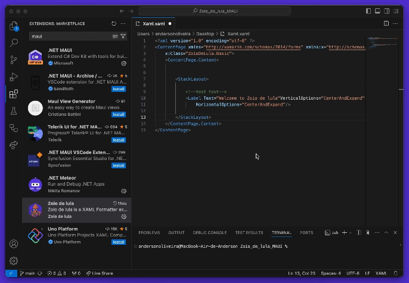
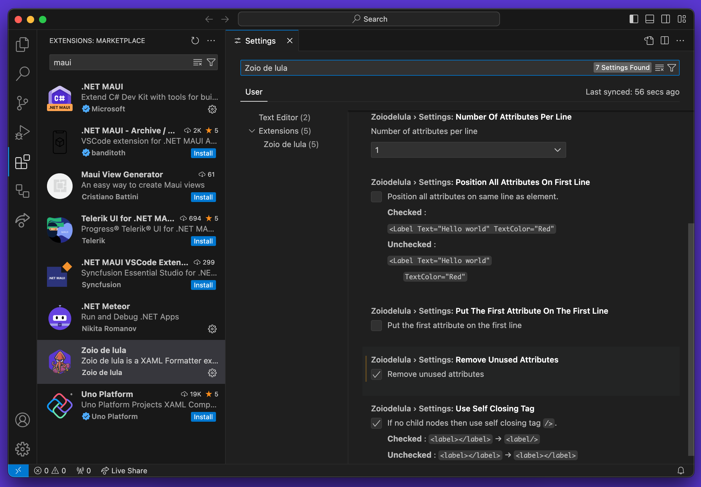

# Zoio de Lula

Zoio de lula is a XAML Formatter extension for Visual Studio Code

## Settings

| Setting Key                                            | Description                                | Default Value |
| ------------------------------------------------------ | ------------------------------------------ | ------------- |
| zoiodelula.settings.numberOfAttributesPerLine          | number of attributes per line              | 1             |
| zoiodelula.settings.positionAllAttributesOnFirstLine   | Position all attributes first line         | false         |
| zoiodelula.settings.putTheFirstAttributeOnTheFirstLine | Put the first attribute on the first line  | false         |
| zoiodelula.settings.removeUnusedAttributes             | Remove unused "xmlns:" attributes          | false         |
| zoiodelula.settings.useSelfClosingTag                  | If no child nodes then self closing tag /> | true          |

## How to run the project

Make a git clone

Open in vscode

Open terminal in project folder and run npm install

Run npm test

Now everything is ready for you to work!
